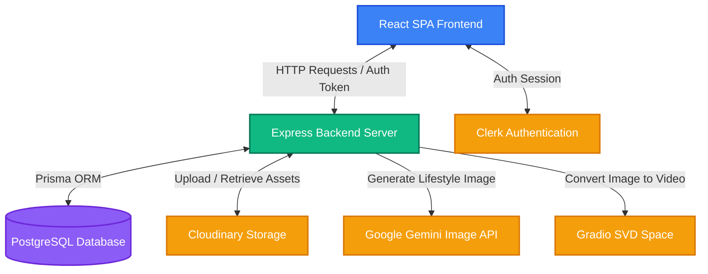
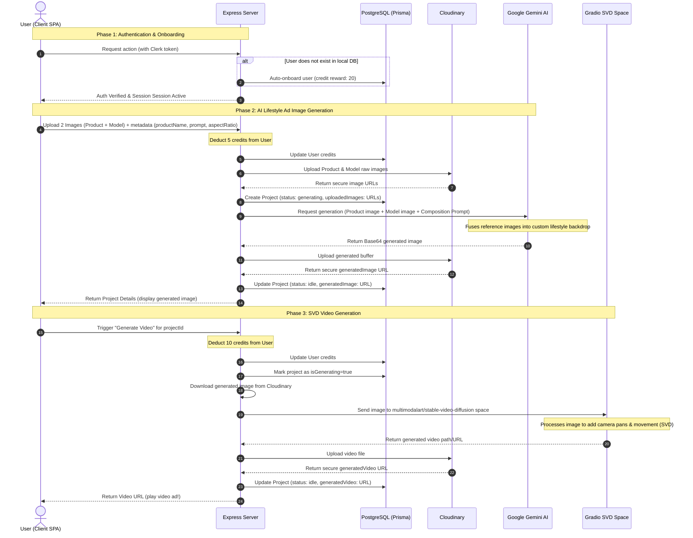

# System Flow & Architecture

Welcome to the **AI Short Video Ads Generator** system architecture and flow diagram document. This document outlines how the frontend, backend, database, and various external AI & media services interact to deliver a seamless ad generation experience.

---

## 🏗️ System Architecture

The application is built on a modern decoupled stack: a **React + TypeScript (Vite)** SPA frontend, an **Express + Node.js (TypeScript)** API server, a **PostgreSQL** database managed with **Prisma ORM**, and cloud services for asset management and AI processing.

---

## 🔄 User & Data Flow Diagram

The process consists of two primary sequential pipelines:
1. **Ad Image Generation Pipeline**
2. **Video Generation Pipeline**

Here is the exact sequential workflow for generating an ad:

---

## 🔍 Detailed Component Flow

### 1. Client App (`/client`)
- **UploadZone**: Accepts two source files: a clean product shot and a model/lifestyle reference shot.
- **Generator Form**: Gathers key promotional parameters (Product Name, Product Description, Custom Target Prompt, Aspect Ratio, and Duration).
- **Result Screen**: Renders the AI composite image immediately after generation. Displays the active rendering states during Stable Video Diffusion (SVD) video rendering.
- **My Generations & Community Showcase**: Offers views to look up past projects or publish successful ads to the community feed.

### 2. Backend Server (`/server`)
- **Authentication Middlewares**: Verifies JSON Web Tokens (JWT) signed by Clerk before allowing any protected mutation.
- **Multer Storage**: Handles disk-based multi-part file uploads locally before streaming them to Cloudinary.
- **API Pool Manager**: Automatically cycles through configured Google Cloud API Keys if one is rate-limited or hits quota thresholds during Gemini operations.
- **Gemini Ad Image Fusion Engine**: Compiles a highly detailed multi-part prompt, attaching the product image as Reference 1 and the model image as Reference 2. It utilizes models like `gemini-2.5-flash-image` and `gemini-3-pro-image-preview` with dual modality outputs (`Modality.TEXT` & `Modality.IMAGE`).
- **Gradio Bridge Client**: Pulls SVD frames asynchronously from `multimodalart/stable-video-diffusion` and processes the video streams.

### 3. Database Layer (`prisma/schema.prisma`)
- **User Model**: Holds Clerk ID, user profile data, and balances credits. Every new user receives a default of `20 credits`.
- **Project Model**: Stores project titles, metadata, arrays of source files uploaded to Cloudinary, generated media urls, rendering progress states, and error handling logs.

---

## 💳 Credit System Rules
- **Onboarding**: `+20 credits` (Automatically on first login).
- **Image Composition**: `-5 credits` (Successfully fusing product & model reference images).
- **Video Motion Generation**: `-10 credits` (Generating short motion clip via Stable Video Diffusion).
- **Refund Policy**: If an API or model fail occurs, the server automatically executes a rollback transaction, returning the credits back to the user's balance.
